# ECharts之性能优化

## 背景

`ECharts`在大规模数据渲染下性能表现优秀，基于现有的知识体系我们猜测可能应用了：

1. **数据抽取**策略，在已确认的小画布大数据，数据无法完全展示的场景下对数据做采样仅展示关键帧数据。
2. **离屏渲染**一种比较常见的针对复杂场景、重复元素的`canvas`性能优化解决方案。
3. **多层画布**对于背景元素、数据元素、交互提示类元素做分层处理对于样式稳定的元素单独绘制，不再重绘。

`ECharts`应用了哪些性能优化方案？如何去实现的？我们根据[宿爽 - 16毫秒的挑战_图表库渲染优化](https://www.bilibili.com/video/BV1344y1y7mY?from=search&seid=10961982352971093195&spm_id_from=333.337.0.0)尝试从ECharts的源码中来一探究竟。

## 要解决的问题

+ 完成渲染
+ 交互流畅
+ 呈现效果流畅

## 性能优化点

### 降采样

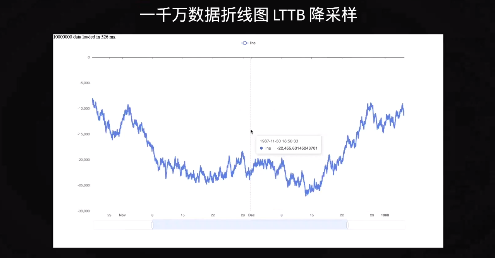

**降采样**即**数据抽取**策略，这里ECharts采用了**LTTB**算法。

### 减少canvas的状态切换

 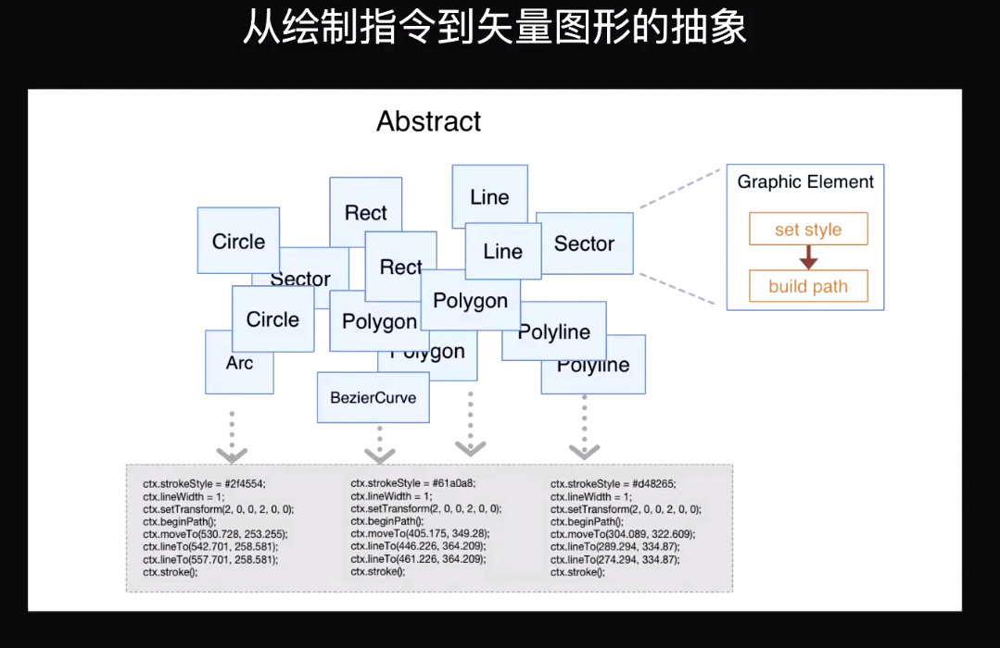

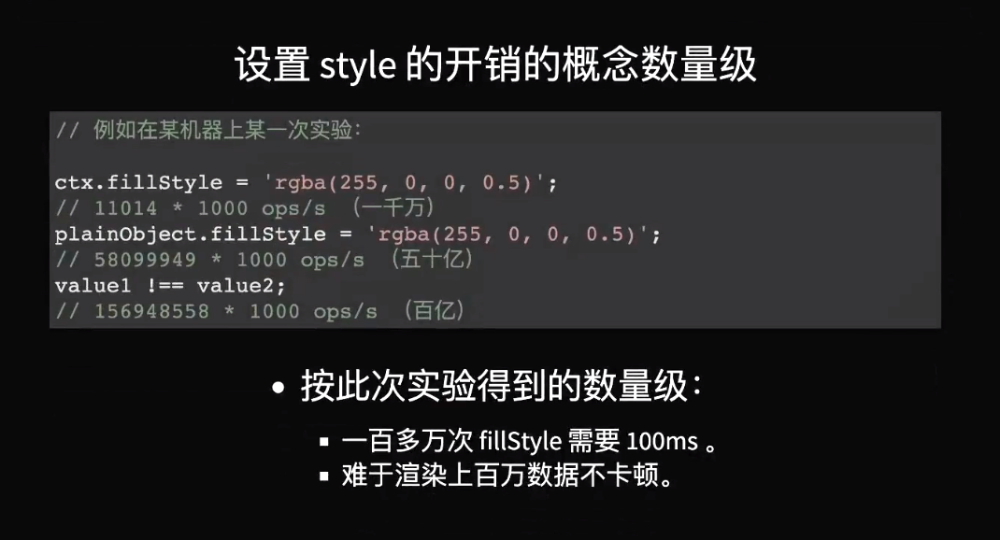

`ZRender`会将`canvas`的底层API做一层抽象用于绘制各个基础图形元素。在绘制不同的元素的时候会执行大量的`canvas` `context`状态操作，这些操作虽然足够快速但在大数据量下仍然耗时较长，echarts这里采用的方式是先比较`context`状态是否发生变化，再确认变化后在执行状态切换操作（渲染大量数据的时候考虑到视觉的一致性普遍会采用相同或相近的样式，例如大量的折线图的节点、柱状图的柱子等场景）。

### 二维数组转一位数组或TypedArray

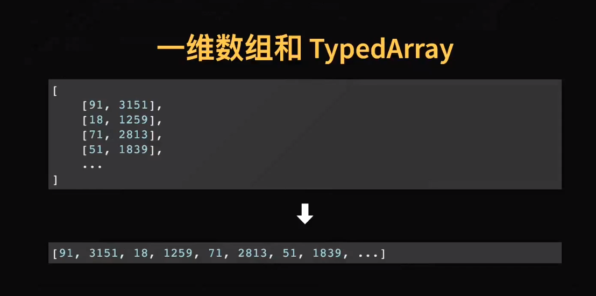

从下图的实验中可见一维数组在数据的读取和交互上会有较打的提升。

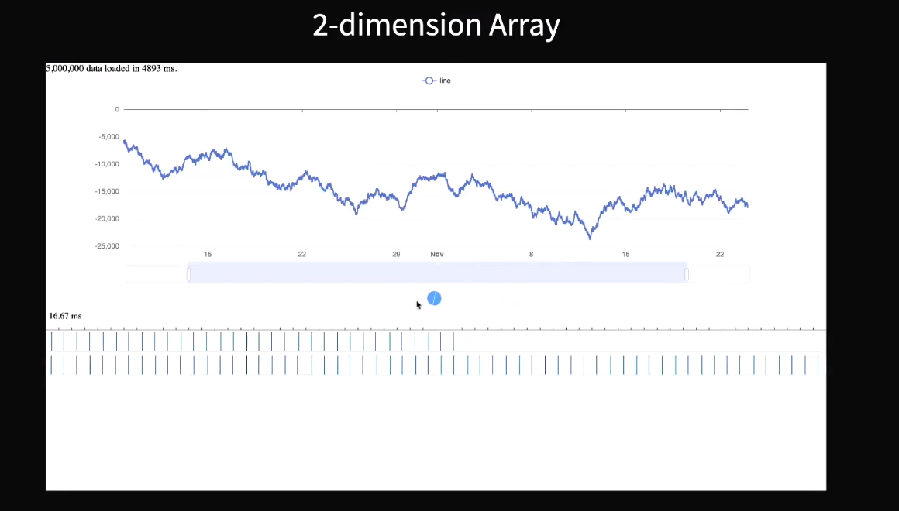

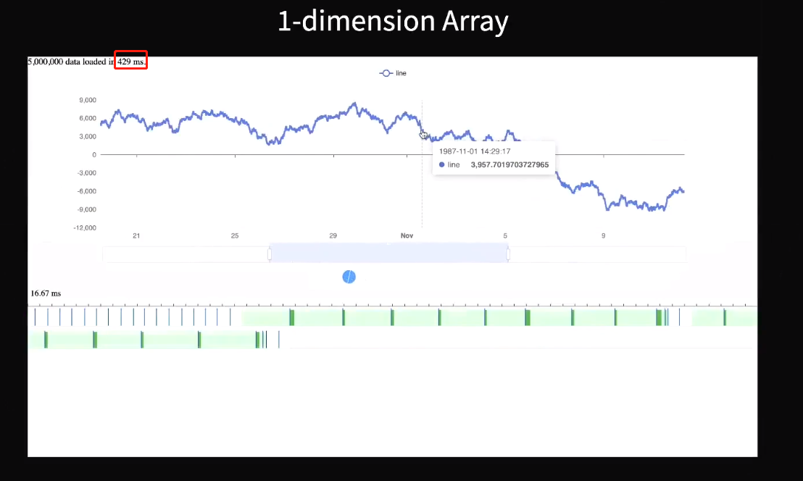

### GC减少

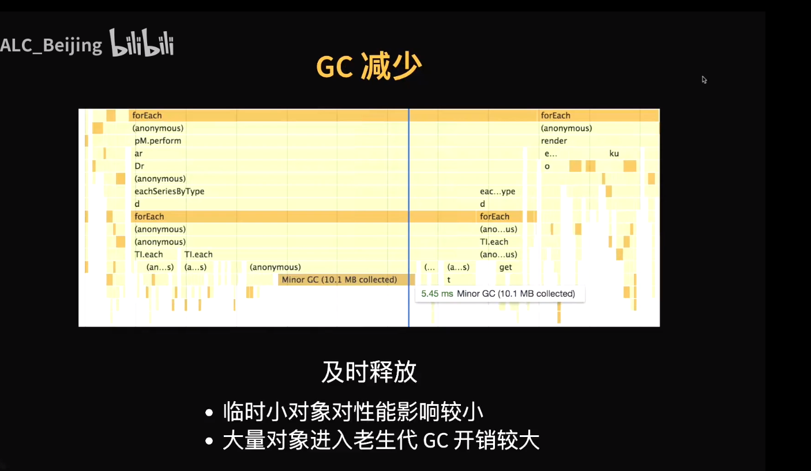

### 并发

#### Worker

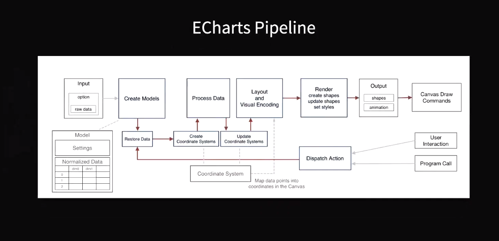

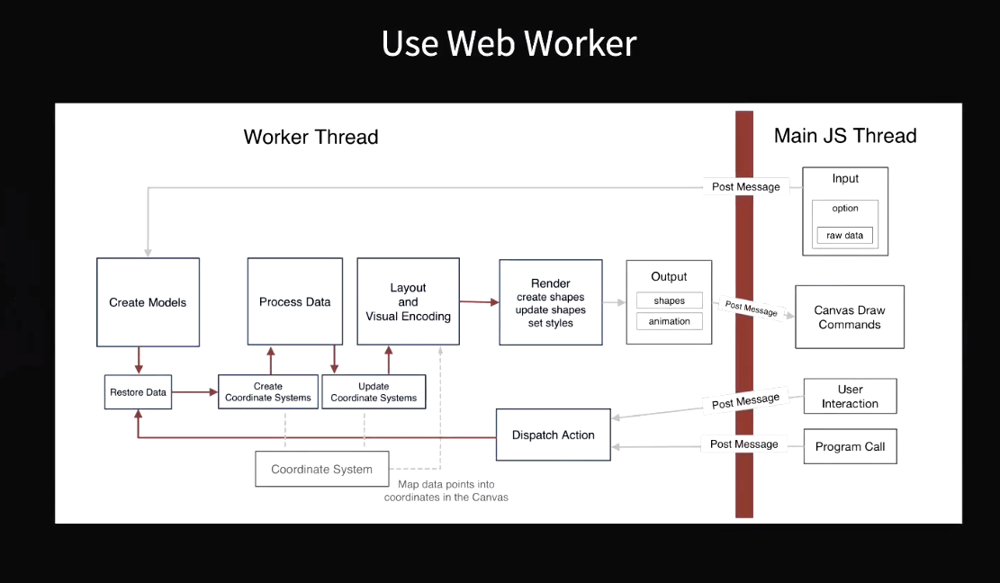

采用Worker将计算密集型任务拆分出去，不阻塞主线程。但当某个被交互的图形本身包含大量的数据是，单个Worker进程仍需要大量时间。

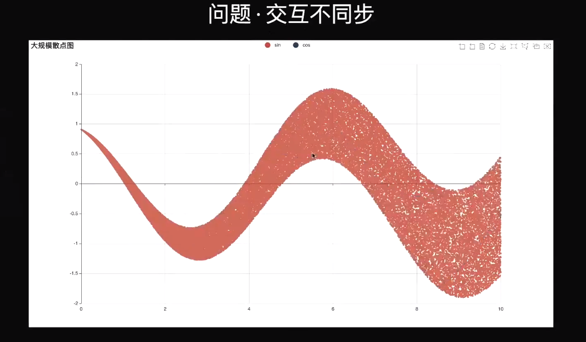

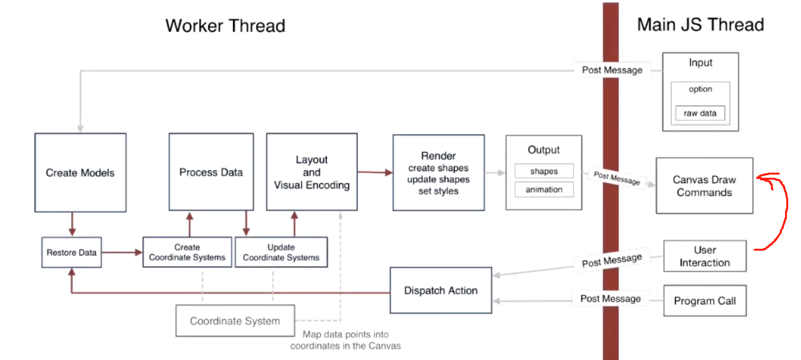

#### 渐进渲染

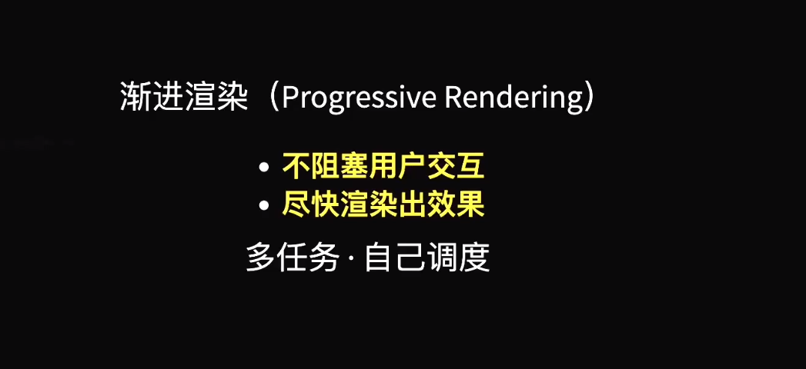

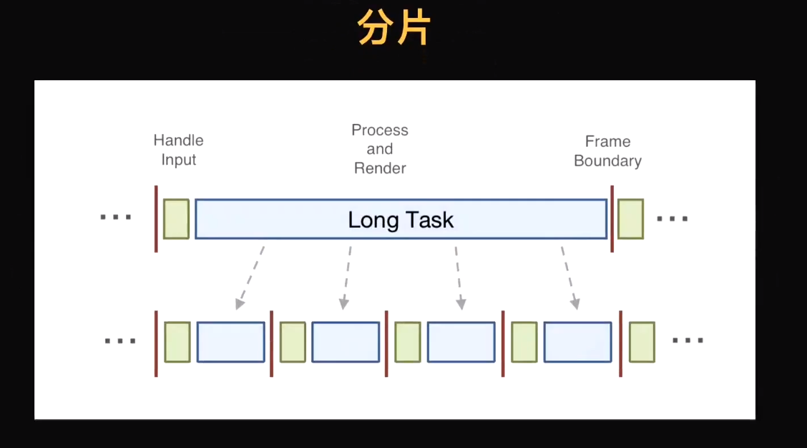

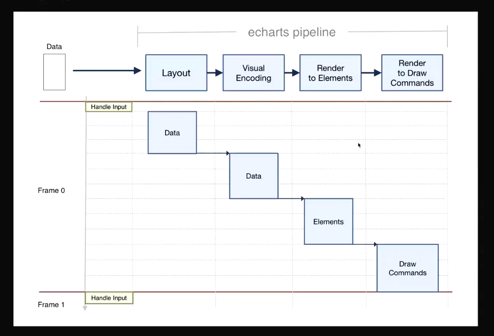

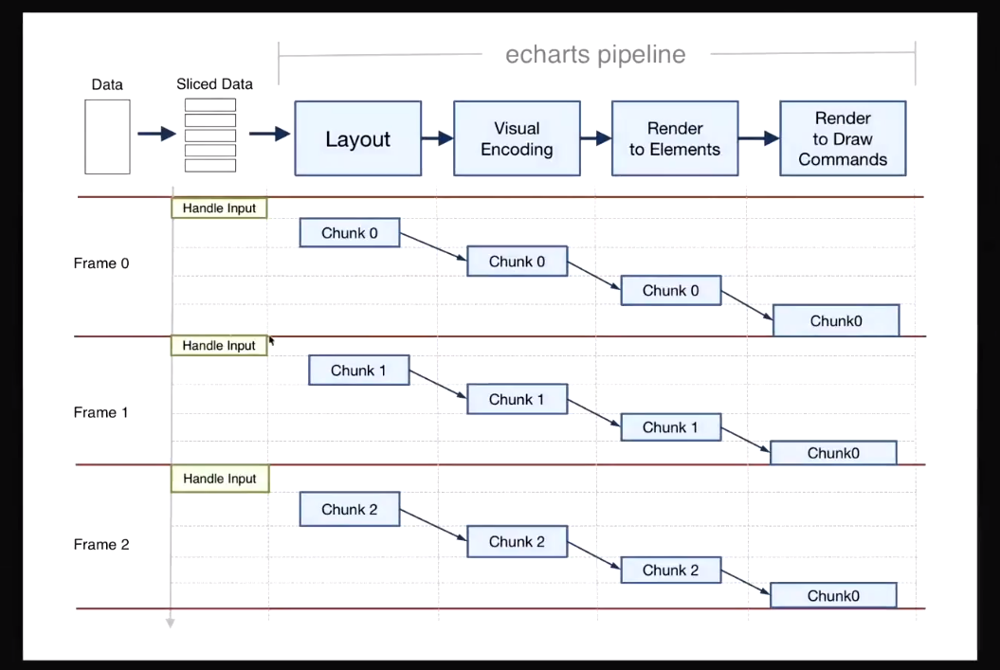

### 多层画布

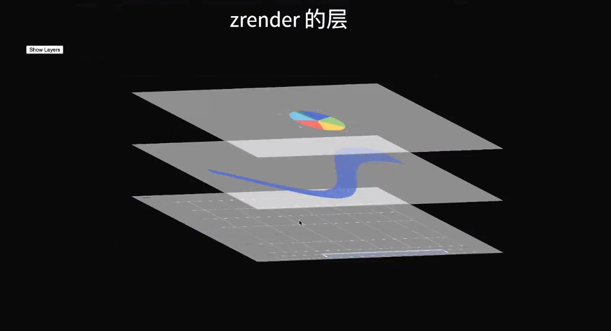

### RequestIdleCallBack

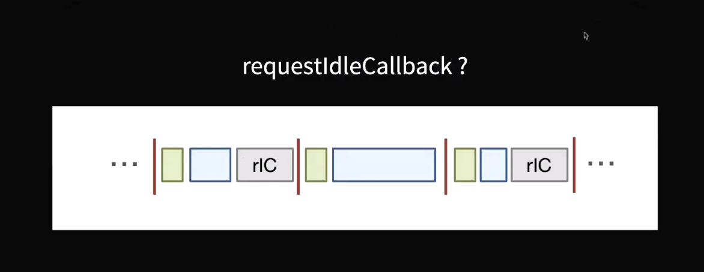

在`requestIdleCallback`中根据剩余时间判断当前帧要渲染多少数据以进行渐进渲染。同样存在问题一是`requestIdleCallback`作为一个实验性功能兼容性仍不时特别完善、二是`requestIdleCallback`优先级过低，在某些场景下浏览器已经渲染多帧但仍得不到调用。

## 总结 

整体来说在`ECharts`性能优化上没有银弹，没有哪种方式能一次性的很好的解决性能问题，只能一点一点的去扣时间。总体来说在性能优化上分为三类

1. 渲染层面: canvas性能优化类

   `ECharts`大规模数据渲染普遍会采用`canvas`作为引擎这里会用一些通用的`canvas`性能优化的技术例如：**减少canvas的状态切换次数**、**多层画布**等。

2. 数据处理层面: 大规模数据处理性能优化类

   性能问题普遍发生在数据规模比较大时、所以从数据结构和数据处理层面入手做性能优化是一个很好的入口，这里ECharts应用了**降采样**、**二维数据转`TypedArray`**,**尽量短的生命周期以减少GC时间**等方案。

3. 任务调度层面："多线程"类

   这里`ECharts`尝试了**web worker**和**分批渲染**，`web worker`可以解决主线程的阻塞性问题。分批渲染可以解决首次渲染时间问题。 

## 参考 & 引用

[ApacheCon Asia 2021 数据可视化：宿爽 - 16毫秒的挑战_图表库渲染优化 - 中文_哔哩哔哩_bilibili](https://www.bilibili.com/video/BV1344y1y7mY?from=search&seid=10961982352971093195&spm_id_from=333.337.0.0)

[什么是 Minor GC/Major GC - 知乎 (zhihu.com)](https://zhuanlan.zhihu.com/p/134546736)

[requestIdleCallback - Web API 接口参考 | MDN (mozilla.org)](https://developer.mozilla.org/zh-CN/docs/Web/API/Window/requestIdleCallback)
