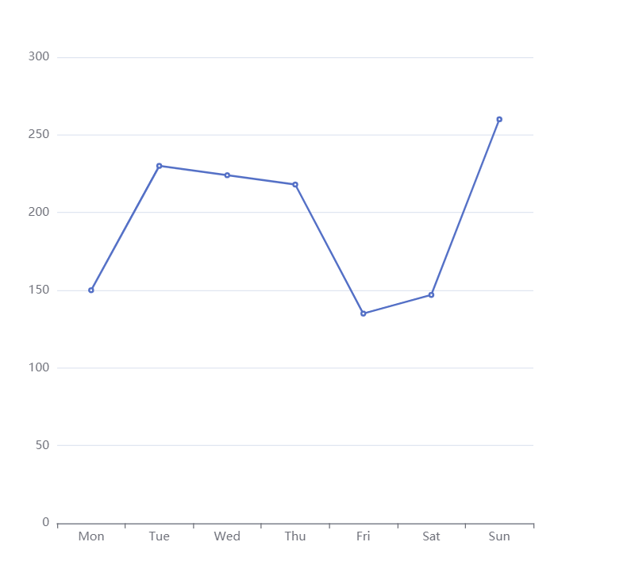
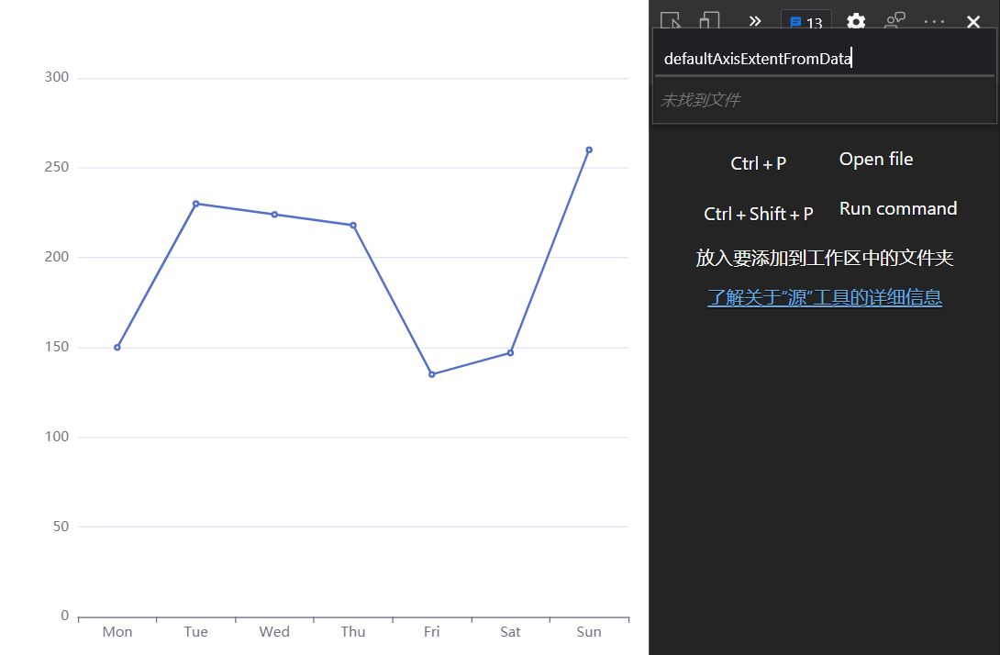
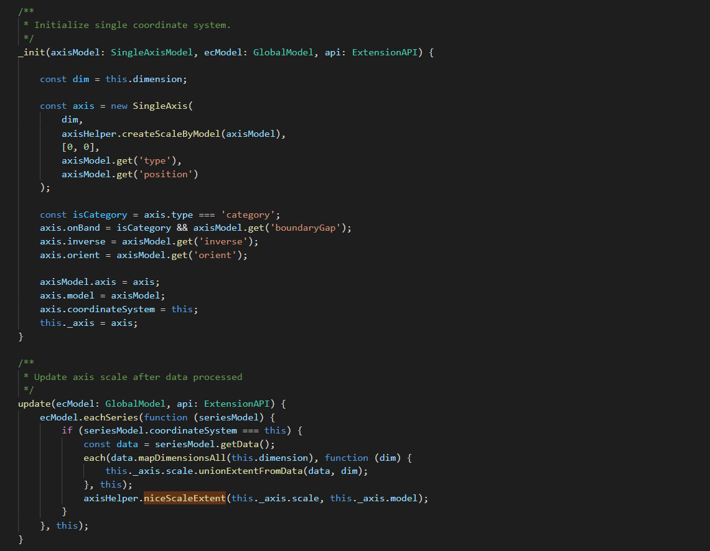
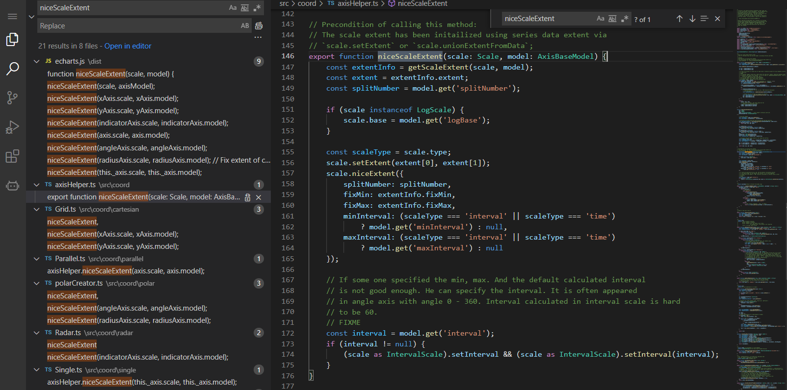
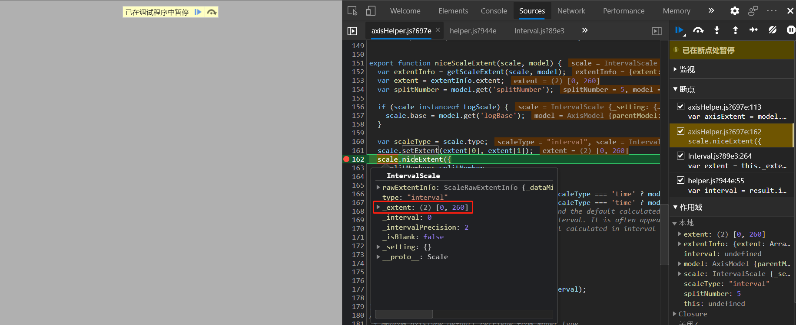

# ECharts源码解析之NiceTick,NiceExtent

## 版本：V5.0.2

## 背景

ECharts基于笛卡尔坐标系的`折线图`，`柱状图`。默认自适应的Y轴普遍都很整齐美观(间隔，最大值是默认是整数且通常为10的倍数，对人类友好)。这是如何实现的呢？我们尝试从ECharts的源码中来一探究竟。


## 定位实现代码

> 这里简单记录了一下代码的定位过程，代码跟踪的过程相对繁琐，而且包含很多失败的尝试，对核心内容和结论无影响，可直接跳过。

1. 根据[ECharts源码解析之代码组织结构](./ECharts源码解析之代码组织结构.md)可以大致猜测`轴线分割`部分的代码可能存在在[一些坐标系布局算法](https://github.com/apache/echarts/tree/master/src/coord)中。

2. 后找到[笛卡尔坐标系](https://github.com/apache/echarts/tree/master/src/coord/cartesian).

3. 然后我们发下一个叫[defaultAxisExtentFromData](https://github1s.com/apache/echarts/blob/master/src/coord/cartesian/defaultAxisExtentFromData.ts)的文件，从名字来看应该是在根据数据生成默认的轴范围。

4. 大致看一下代码发现给ECharts注册了一个进程`echarts.registerProcessor(echarts.PRIORITY.PROCESSOR.FILTER + 10, {})`执行了某些操作，在`reSet`的时候执行了几个方法`prepareDataExtentOnAxis`,`calculateFilteredExtent`,`shrinkAxisExtent`在准备轴上的数据块，计算过滤范围，收缩轴范围。看似可能存在在这里或者内部。

5. 接下来尝试通过`断点跟踪(Debug)`的方式来尝试跟踪该文件，观察执行逻辑和内部参数数值的变化，来推断执行过程(通过仅追踪静态代码，尝试分析一方面容易出错，一方面如果逻辑嵌套很深则难度较大效率很低)。

6. 起一个项目(TODO)尝试追踪`defaultAxisExtentFromData`的执行过程。

7. 居然未发现该文件即说明刚才对坐标轴布局逻辑存在在该文件中的判断很可能是错误的。

8. 想来`自适应的轴线间隔`的功能也会在[单轴坐标系](https://github1s.com/apache/echarts/blob/HEAD/src/coord/single/Single.ts)中应用尝试在该文件中查找具体的实现。

9. 可以看到内部有一些`init`或`update`的方法，其中`update`中调用的`niceScaleExtent`方法从字面意思来看与我们要找的很像，接下来尝试检索一下这个方法的具体实现。

10. 该函数被定义在[axisHelper](https://github1s.com/apache/echarts/blob/HEAD/src/coord/axisHelper.ts)中且被`grid`,`parallel`,`radar`,`single`等多个坐标系调用，说明思路可能是对的。接下来对`axisHelper`的`niceScaleExtent`进行`debug`

11. 可以看到的确执行了进来且`_extent`的范围的确是我们给出的数据列的值范围，在执行完`scale.niceExtent`之后`_extent`的值变成了`[0,300]`(为了节省篇幅这里不贴图了)。

    

12. 全局搜索`niceExtent`定位到了[Interval.js](https://github1s.com/apache/echarts/blob/HEAD/src/scale/Interval.ts).至此算是定位到了`轴线自适应分段`的实现代码，接下来会介绍这个实现的核心逻辑。

## 核心逻辑

```typescript
   // 这部分将真实的数值范围变成了美化后的以整数分割的范围
   niceExtent(opt: {
        splitNumber: number, // 轴线的分段数 默认是5 By default 5.
        fixMin?: boolean, // 最小值是否已`nice`化
        fixMax?: boolean, // 最大值是否已`nice`化
        minInterval?: number, // 最小间隔 默认为undefined
        maxInterval?: number // 最大间隔 默认为undefined
    }): void {
        const extent = this._extent;
        // If extent start and end are same, expand them
        // 如果范围的开始和结束一样  处理逻辑 
        if (extent[0] === extent[1]) {
            if (extent[0] !== 0) {
                // Expand extent
                const expandSize = extent[0];
                // In the fowllowing case
                //      Axis has been fixed max 100
                //      Plus data are all 100 and axis extent are [100, 100].
                // Extend to the both side will cause expanded max is larger than fixed max.
                // So only expand to the smaller side.
                if (!opt.fixMax) {
                    extent[1] += expandSize / 2;
                    extent[0] -= expandSize / 2;
                }
                else {
                    extent[0] -= expandSize / 2;
                }
            }
            else {
                extent[1] = 1;
            }
        }
        const span = extent[1] - extent[0];
        // 如果范围是默认的无限的处理逻辑
        // If there are no data and extent are [Infinity, -Infinity]
        if (!isFinite(span)) {
            extent[0] = 0;
            extent[1] = 1;
        }

        // 核心代码 先 `niceTicks` 再 `niceExtent`
        this.niceTicks(opt.splitNumber, opt.minInterval, opt.maxInterval);

        // let extent = this._extent;
        const interval = this._interval;

        if (!opt.fixMin) {
            extent[0] = roundNumber(Math.floor(extent[0] / interval) * interval);
        }
        if (!opt.fixMax) {
            extent[1] = roundNumber(Math.ceil(extent[1] / interval) * interval);
        }
    }
     /**
     * @param splitNumber By default `5`.
     */
    // 根据分段数和,最小间隔,最大间隔获得一个好看的`tick`
    niceTicks(splitNumber?: number, minInterval?: number, maxInterval?: number): void {
        splitNumber = splitNumber || 5;
        const extent = this._extent;
        // 算是异常处理
        let span = extent[1] - extent[0];
        if (!isFinite(span)) {
            return;
        }
        // User may set axis min 0 and data are all negative
        // FIXME If it needs to reverse ?
        if (span < 0) {
            span = -span;
            extent.reverse();
        }

        // 核心逻辑
        const result = helper.intervalScaleNiceTicks(
            extent, splitNumber, minInterval, maxInterval
        );

        this._intervalPrecision = result.intervalPrecision;
        this._interval = result.interval;
        this._niceExtent = result.niceTickExtent;
    }
    
    /**
     * @param extent Both extent[0] and extent[1] should be valid number.
     *               Should be extent[0] < extent[1].
     * @param splitNumber splitNumber should be >= 1.
     */
    // 根据分段数和,最小间隔,最大间隔获得一个好看的`tick`
    // 接下来会以注释的方式给一些参数赋值，以解释执行过程
    export function intervalScaleNiceTicks(
        extent: [number, number],
        splitNumber: number,
        minInterval?: number,
        maxInterval?: number
    ): intervalScaleNiceTicksResult {

        const result = {} as intervalScaleNiceTicksResult;
        
        // 这里计算了范围
        //   260       260          0
        const span = extent[1] - extent[0];
        // `nice`如何工作见下文 这里求得了一个`nice interval`
        //   50            50                            260  /  5
        let interval = result.interval = numberUtil.nice(span / splitNumber, true);
        if (minInterval != null && interval < minInterval) {
            interval = result.interval = minInterval;
        }
        if (maxInterval != null && interval > maxInterval) {
            interval = result.interval = maxInterval;
        }
        // Tow more digital for tick.
        // 这里求得了一个精度 默认最小为两个精度
        const precision = result.intervalPrecision = getIntervalPrecision(interval);
        // Niced extent inside original extent
        // 在原始范围内求得一个良好的范围
        // [0,250]
        const niceTickExtent = result.niceTickExtent = [
            // 对最小值向上取整 对最大值向下取整
            roundNumber(Math.ceil(extent[0] / interval) * interval, precision),
            roundNumber(Math.floor(extent[1] / interval) * interval, precision)
        ];
        
        fixExtent(niceTickExtent, extent);
        
        //    [0,250]
        return result;
    }


/**
* 找到一个大约等于x的'好'数。如果Round=true，则对数字进行四舍五入，
* 如果round=false，则取天花板。初步观察是'最好的'
* 十进制的数字是1,2,5,以及这些数字的十倍的所有幂。
*/
/**
 * find a “nice” number approximately equal to x. Round the number if round = true,
 * take ceiling if round = false. The primary observation is that the “nicest”
 * numbers in decimal are 1, 2, and 5, and all power-of-ten multiples of these numbers.
 *
 * See "Nice Numbers for Graph Labels" of Graphic Gems.
 *
 * @param  val Non-negative value.
 * @param  round
 * @return Niced number
 */
export function nice(val: number, round?: boolean): number {
    // 求val的数量级
    //     1                          52(260/5)
    const exponent = quantityExponent(val);
    //     10                     1
    const exp10 = Math.pow(10, exponent);
    //   5.2 =  52 / 10
    const f = val / exp10; // 1 <= f < 10
    let nf;
    // 是否要对数字进行四舍五入
    // 要四舍五入的化··· 
    // [0-1.5]范围内的会归约为1.5 其余同理
    // nf 是一个'好'的基础单位，例如这里的nf只可能是1,2,3,5,10之后会在nf的基础上*一个10的倍数即可以得到一个`nice number`
    if (round) {
        if (f < 1.5) {
            nf = 1;
        }
        else if (f < 2.5) {
            nf = 2;
        }
        else if (f < 4) {
            nf = 3;
        }
        else if (f < 7) {
            nf = 5;
        }
        else {
            nf = 10;
        }
    }
    else {
        if (f < 1) {
            nf = 1;
        }
        else if (f < 2) {
            nf = 2;
        }
        else if (f < 3) {
            nf = 3;
        }
        else if (f < 5) {
            nf = 5;
        }
        else {
            nf = 10;
        }
    }
    // 以上 nf 走下来为5
 //  50 = 5  * 10;  
    val = nf * exp10;
    
    // 这里修复了下js的浮点数溢出问题
    // Fix 3 * 0.1 === 0.30000000000000004 issue (see IEEE 754).
    // 20 is the uppper bound of toFixed.
    return exponent >= -20 ? +val.toFixed(exponent < 0 ? -exponent : 0) : val;
}
    
```

## 总结 

总体来说要实现友好的间隔(`niceTicks` )和范围(`niceExtent`)，首先要根据`原始的值的范围`和`分段数量`来获取每个分段的大小，在对这个数字进行美化，具体美化规则见上文代码，大体思路为判断数字的首位距离`1,2,3,5,10`谁更近就将其作为数字的首位并抹去其余位的数字。获得美化后的分段大小后再根据分段的大小和原始范围来确定分段的个数。这部分的理论依据见[Nice numbers for graph labels - heckbert 1990.pdf · Yuque](https://www.yuque.com/office/yuque/0/2019/pdf/185317/1546999112088-2124d9da-a42b-47c6-a475-10b005372220.pdf?from=https%3A%2F%2Fwww.yuque.com%2Fneowang%2Fzjvis%2Ffn5dgf)。

## 参考 & 引用

[刻度优化算法 Nice Number Algorithms · 语雀 (yuque.com)](https://www.yuque.com/neowang/zjvis/fn5dgf?language=en-us)