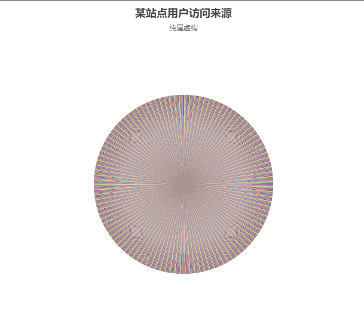
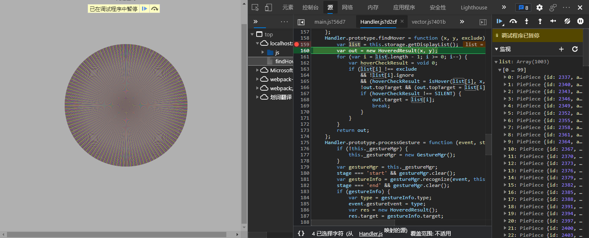
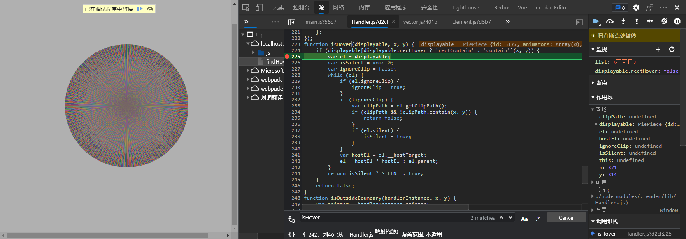
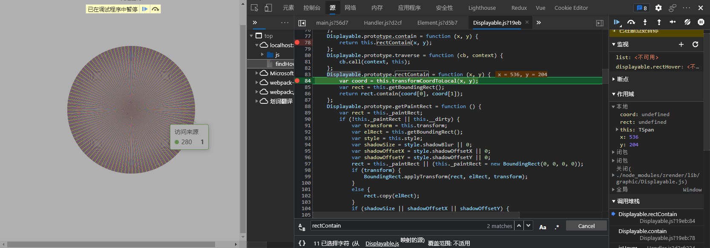
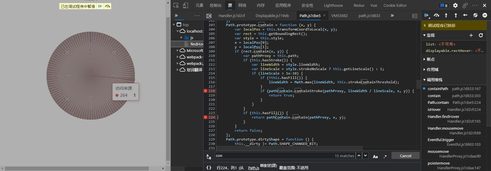
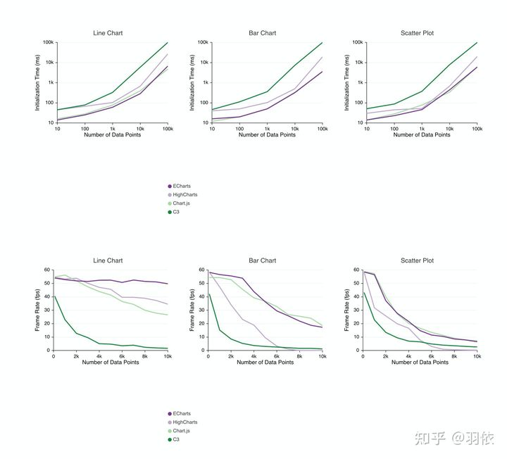
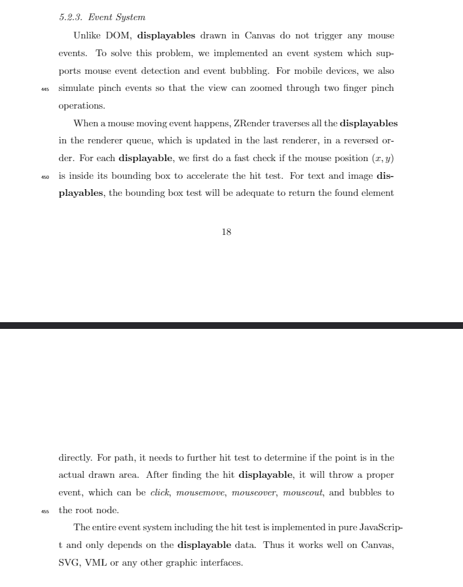

ECharts源码解析之 FindHover

## ECharts版本：V5.0.2 ZRender版本 V5.1.1

## 背景

`Canvas`作为一个单独的`DOM`元素，内部是用一维数组来存储的像素数据，也就意味着无法和`HTML`一样直接对其内部的元素做事件绑定。如何去做`Canvas`内部的事件响应以及，一旦`Canvas`中的元素多起来如何去做性能优化。我们尝试从`ECharts`的源码中来一探究竟。

> 这里放了一个具有一千个元素(扇形)的饼图，我们通过该示例来跟踪源码探究`ECharts`是如何实现的。




## 定位实现代码

> 这里简单记录了一下代码的定位过程，代码跟踪的过程相对繁琐，而且包含很多失败的尝试，对核心内容和结论无影响，可直接跳过。

1. 根据[ECharts源码解析之代码组织结构](./ECharts源码解析之代码组织结构.md)可以大致猜测事件可能定义在[event.ts - apache/echarts](https://github1s.com/apache/echarts/blob/HEAD/src/util/event.ts)中。

2. [event.ts - apache/echarts](https://github1s.com/apache/echarts/blob/HEAD/src/util/event.ts)中的核心为`Element`在[Element.ts - ecomfe/zrender ](https://github1s.com/ecomfe/zrender/blob/HEAD/src/Element.ts)中，我们有理由猜测事件系统被实现在了`zrender`中。

3. 在`zrender`中发现[Handler.ts/zrender](https://github1s.com/ecomfe/zrender/blob/HEAD/src/Handler.ts)似乎是事件的主类内部定义了`mousemove`,`mouseout`,`dispatchToElement`,`findHover`等等方法。这里我们来重点关注`findHover`的实现。尝试Debug看是否有触发`findHover`

   

   可以看到的确触发了`findHover`方法而且可以很容易的猜测`[x,y]`即为事件发生的坐标，`list`即为该饼图中所存在的元素列表(包含但不局限扇形)。这里在对饼图中的循环做判断是否覆盖该元素、如果是则返回。

4. 接下来跟踪`isHover`方法可以看到该方法内部对元素类型做了个判断如果是矩形类会调用`rectContain`方法来判断当前坐标是否在该矩形内部，如果是非矩形类则调用的是`contain`方法。可以判断是`Displayable`类内部对当前坐标是否在元素上做了判断，我们重点关注一下该类。

   

5. 接着往下跟发现在[Displayable.ts - ecomfe/zrender ](https://github1s.com/ecomfe/zrender/blob/HEAD/src/graphic/Displayable.ts)中判断了该坐标是否命中图形，对于一些Rect类的直接在`Displayable`类中做了判断，对于`PiePiece`在[Path.ts - ecomfe/zrender](https://github1s.com/ecomfe/zrender/blob/HEAD/src/graphic/Path.ts)中做了判断。

   

   

6. 对于多边形Zrender分别判断了是否在边线上以及对于有填充的图形判断了是否在图形内部。 


## 核心逻辑

```typescript
Handler.prototype.findHover = function (x, y, exclude) {
    var list = this.storage.getDisplayList();
    var out = new HoveredResult(x, y);
    // 这里在循环每个元素 判断该元素是否被覆盖
    for (var i = list.length - 1; i >= 0; i--) {
        var hoverCheckResult = void 0;
        if (list[i] !== exclude
            && !list[i].ignore
            && (hoverCheckResult = isHover(list[i], x, y))) {
            !out.topTarget && (out.topTarget = list[i]);
            if (hoverCheckResult !== SILENT) {
                out.target = list[i];
                break;
            }
        }
    }
    return out;
};

function isHover(displayable, x, y) {
    // 这里调用了 displayable 类的rectContain或contain方法来判断坐标(x,y)是否在图形内部
    if (displayable[displayable.rectHover ? 'rectContain' : 'contain'](x, y)) {
        var el = displayable;
        var isSilent = void 0;
        var ignoreClip = false;
        while (el) {
            if (el.ignoreClip) {
                ignoreClip = true;
            }
            if (!ignoreClip) {
                var clipPath = el.getClipPath();
                if (clipPath && !clipPath.contain(x, y)) {
                    return false;
                }
                if (el.silent) {
                    isSilent = true;
                }
            }
            var hostEl = el.__hostTarget;
            el = hostEl ? hostEl : el.parent;
        }
        return isSilent ? SILENT : true;
    }
    return false;
}
Displayable.prototype.contain = function (x, y) {
    return this.rectContain(x, y);
};
Displayable.prototype.rectContain = function (x, y) {
    var coord = this.transformCoordToLocal(x, y);
    // 这里获得了该元素的外围盒
    var rect = this.getBoundingRect();
    // 返回坐标(x,y)是否在矩形内。
    return rect.contain(coord[0], coord[1]);
};

Path.prototype.contain = function (x, y) {
        var localPos = this.transformCoordToLocal(x, y);
        // 这里获取的图形的外围包围盒
        var rect = this.getBoundingRect();
        var style = this.style;
        x = localPos[0];
        y = localPos[1];
        // 判断是否在包围盒内
        if (rect.contain(x, y)) {
            var pathProxy = this.path;
            // 判断是坐标是否在图形的边线上
            if (this.hasStroke()) {
                var lineWidth = style.lineWidth;
                var lineScale = style.strokeNoScale ? this.getLineScale() : 1;
                if (lineScale > 1e-10) {
                    if (!this.hasFill()) {
                        lineWidth = Math.max(lineWidth, this.strokeContainThreshold);
                    }
                    if (pathContain.containStroke(pathProxy, lineWidth / lineScale, x, y)) {
                        return true;
                    }
                }
            }
            // 如果该图形有填充 判断坐标是否在图形的边线内部
            if (this.hasFill()) {
                return pathContain.contain(pathProxy, x, y);
            }
        }
        return false;
    };
}

// 一个标准的判断坐标是否在多边形内部的方法，这里不再深究
function containPath(path, lineWidth, isStroke, x, y) {
    var data = path.data;
    var len = path.len();
    var w = 0;
    var xi = 0;
    var yi = 0;
    var x0 = 0;
    var y0 = 0;
    var x1;
    var y1;
    for (var i = 0; i < len;) {
        var cmd = data[i++];
        var isFirst = i === 1;
        if (cmd === CMD.M && i > 1) {
            if (!isStroke) {
                w += windingLine(xi, yi, x0, y0, x, y);
            }
        }
        if (isFirst) {
            xi = data[i];
            yi = data[i + 1];
            x0 = xi;
            y0 = yi;
        }
        switch (cmd) {
            case CMD.M:
                x0 = data[i++];
                y0 = data[i++];
                xi = x0;
                yi = y0;
                break;
            case CMD.L:
                if (isStroke) {
                    if (line.containStroke(xi, yi, data[i], data[i + 1], lineWidth, x, y)) {
                        return true;
                    }
                }
                else {
                    w += windingLine(xi, yi, data[i], data[i + 1], x, y) || 0;
                }
                xi = data[i++];
                yi = data[i++];
                break;
            case CMD.C:
                if (isStroke) {
                    if (cubic.containStroke(xi, yi, data[i++], data[i++], data[i++], data[i++], data[i], data[i + 1], lineWidth, x, y)) {
                        return true;
                    }
                }
                else {
                    w += windingCubic(xi, yi, data[i++], data[i++], data[i++], data[i++], data[i], data[i + 1], x, y) || 0;
                }
                xi = data[i++];
                yi = data[i++];
                break;
            case CMD.Q:
                if (isStroke) {
                    if (quadratic.containStroke(xi, yi, data[i++], data[i++], data[i], data[i + 1], lineWidth, x, y)) {
                        return true;
                    }
                }
                else {
                    w += windingQuadratic(xi, yi, data[i++], data[i++], data[i], data[i + 1], x, y) || 0;
                }
                xi = data[i++];
                yi = data[i++];
                break;
            case CMD.A:
                var cx = data[i++];
                var cy = data[i++];
                var rx = data[i++];
                var ry = data[i++];
                var theta = data[i++];
                var dTheta = data[i++];
                i += 1;
                var anticlockwise = !!(1 - data[i++]);
                x1 = Math.cos(theta) * rx + cx;
                y1 = Math.sin(theta) * ry + cy;
                if (!isFirst) {
                    w += windingLine(xi, yi, x1, y1, x, y);
                }
                else {
                    x0 = x1;
                    y0 = y1;
                }
                var _x = (x - cx) * ry / rx + cx;
                if (isStroke) {
                    if (arc.containStroke(cx, cy, ry, theta, theta + dTheta, anticlockwise, lineWidth, _x, y)) {
                        return true;
                    }
                }
                else {
                    w += windingArc(cx, cy, ry, theta, theta + dTheta, anticlockwise, _x, y);
                }
                xi = Math.cos(theta + dTheta) * rx + cx;
                yi = Math.sin(theta + dTheta) * ry + cy;
                break;
            case CMD.R:
                x0 = xi = data[i++];
                y0 = yi = data[i++];
                var width = data[i++];
                var height = data[i++];
                x1 = x0 + width;
                y1 = y0 + height;
                if (isStroke) {
                    if (line.containStroke(x0, y0, x1, y0, lineWidth, x, y)
                        || line.containStroke(x1, y0, x1, y1, lineWidth, x, y)
                        || line.containStroke(x1, y1, x0, y1, lineWidth, x, y)
                        || line.containStroke(x0, y1, x0, y0, lineWidth, x, y)) {
                        return true;
                    }
                }
                else {
                    w += windingLine(x1, y0, x1, y1, x, y);
                    w += windingLine(x0, y1, x0, y0, x, y);
                }
                break;
            case CMD.Z:
                if (isStroke) {
                    if (line.containStroke(xi, yi, x0, y0, lineWidth, x, y)) {
                        return true;
                    }
                }
                else {
                    w += windingLine(xi, yi, x0, y0, x, y);
                }
                xi = x0;
                yi = y0;
                break;
        }
    }
    if (!isStroke && !isAroundEqual(yi, y0)) {
        w += windingLine(xi, yi, x0, y0, x, y) || 0;
    }
    return w !== 0;
}
```

## 总结 

总体来说`ZRender`对于`Canvas`内部的事件判断的方式为单独构建了一套事件系统。对于**每一个图形**，`ZRende`会检测一个事件的位置坐标(x, y)是否在图形的包络盒中，对于`Path`类的图形`ZRende`会在命中包围盒后多做两次判断是否命中多边形的边框或内部区域。`ZRende`对于巨量元素的事件判断在性能上的优化方式为构建外围包围盒，在命中包围盒后再判断坐标是否再图形内部减少了大量计算。


## 参考 & 引用

[使用Canvas操作像素 - SegmentFault 思否](https://segmentfault.com/a/1190000015260718)

[package.json - ecomfe/zrender - GitHub1s](https://github1s.com/ecomfe/zrender/blob/HEAD/package.json)

[从论文了解ECharts设计与实现 - 知乎 (zhihu.com)](https://zhuanlan.zhihu.com/p/347325932)

[ECharts: A Declarative Framework for Rapid Construction of Web-based Visualization](extension://oikmahiipjniocckomdccmplodldodja/pdf-viewer/web/viewer.html?file=http%3A%2F%2Fwww.cad.zju.edu.cn%2Fhome%2Fvagblog%2FVAG_Work%2Fecharts.pdf)

[GitHub1s](https://github1s.com/apache/echarts)


## 附录

### ECharts性能对比




### ZRender Event System



