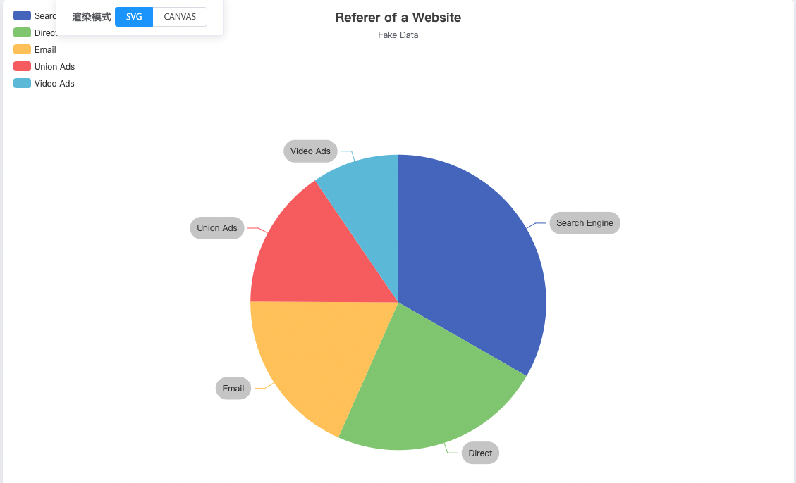
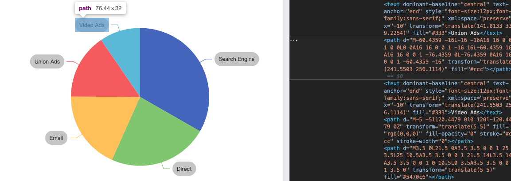

##  版本：V5.3.2

##  背景

由于SVG Text标签并无`background-*`属性所以要实现文字背景，尤其是圆角矩形的背景相对比较困难，虽然有一定的[方案](https://stackoverflow.com/questions/56172331/svg-text-with-background-color-and-rounded-borders)但仍存在各种各样的局限性，最终表现效果并不理想。反观ECharts则实现的非常完美。通过本文我们简单探究下echarts是如何实现SVG圆角矩形背景的。



<!-- more -->

## 简单查看



通过审查DOM元素简单看下，发现ECharts的实现方案是使用`Path`来绘制一个圆角矩形并放置在`Text`的下方，这种方案有两个难点，一个是各种属性，例如`Padding`,`borderRadius`等如何解析为`Path`的路径属性，二是如何判定文字的大小以及具体坐标，如何准确的将绘制的圆角矩形放置在文字下方。

##  源码

Path:  [/src/label/labelLayoutHelper.ts](https://github1s.com/apache/echarts/blob/HEAD/src/label/labelLayoutHelper.ts#L52),

```typescript
export function prepareLayoutList(input: LabelLayoutListPrepareInput[]): LabelLayoutInfo[] {
    const list: LabelLayoutInfo[] = [];

    for (let i = 0; i < input.length; i++) {
        const rawItem = input[i];
        if (rawItem.defaultAttr.ignore) {
            continue;
        }

        const label = rawItem.label;
        const transform = label.getComputedTransform();
        // NOTE: Get bounding rect after getComputedTransform, or label may not been updated by the host el.
        // 这里获取了label的外层包围盒
        const localRect = label.getBoundingRect();
        const isAxisAligned = !transform || (transform[1] < 1e-5 && transform[2] < 1e-5);

        const minMargin = label.style.margin || 0;
        const globalRect = localRect.clone();
        // 这里既算了 实际的 包围盒的 位置和大小
        globalRect.applyTransform(transform);
        globalRect.x -= minMargin / 2;
        globalRect.y -= minMargin / 2;
        globalRect.width += minMargin;
        globalRect.height += minMargin;

        const obb = isAxisAligned ? new OrientedBoundingRect(localRect, transform) : null;

        list.push({
            label,
            labelLine: rawItem.labelLine,
            rect: globalRect,
            localRect,
            obb,
            priority: rawItem.priority,
            defaultAttr: rawItem.defaultAttr,
            layoutOption: rawItem.computedLayoutOption,
            axisAligned: isAxisAligned,
            transform
        });
    }
    return list;
}

```

Path: [/src/graphic/Text.ts](https://github1s.com/ecomfe/zrender/blob/HEAD/src/graphic/Text.ts#L378-L408)

```typescript
getBoundingRect(): BoundingRect {
    if (this.styleChanged()) {
        this._updateSubTexts();
    }
    if (!this._rect) {
        // TODO: Optimize when using width and overflow: wrap/truncate
        const tmpRect = new BoundingRect(0, 0, 0, 0);
        const children = this._children;
        const tmpMat: MatrixArray = [];
        let rect = null;

        for (let i = 0; i < children.length; i++) {
            const child = children[i];
            const childRect = child.getBoundingRect();
            const transform = child.getLocalTransform(tmpMat);

            if (transform) {
                tmpRect.copy(childRect);
                tmpRect.applyTransform(transform);
                rect = rect || tmpRect.clone();
                rect.union(tmpRect);
            }
            else {
                rect = rect || childRect.clone();
                rect.union(childRect);
            }
        }
        this._rect = rect || tmpRect;
    }
    return this._rect;
}
```

Path: [/src/graphic/Text.ts](https://github1s.com/ecomfe/zrender/blob/HEAD/src/graphic/Text.ts#L481-L482)
```typescript
// 这里在更新 常规的文字属性 同时 更新了 text内部rect的信息
private _updatePlainTexts() {
      const style = this.style;
      const textFont = style.font || DEFAULT_FONT;
      const textPadding = style.padding as number[];

      const text = getStyleText(style);
      const contentBlock = parsePlainText(text, style);
      const needDrawBg = needDrawBackground(style);
      const bgColorDrawn = !!(style.backgroundColor);

      const outerHeight = contentBlock.outerHeight;
      const outerWidth = contentBlock.outerWidth;
      const contentWidth = contentBlock.contentWidth;

      const textLines = contentBlock.lines;
      const lineHeight = contentBlock.lineHeight;

      const defaultStyle = this._defaultStyle;

      const baseX = style.x || 0;
      const baseY = style.y || 0;
      const textAlign = style.align || defaultStyle.align || 'left';
      const verticalAlign = style.verticalAlign || defaultStyle.verticalAlign || 'top';

      let textX = baseX;
      let textY = adjustTextY(baseY, contentBlock.contentHeight, verticalAlign);

      if (needDrawBg || textPadding) {
          // Consider performance, do not call getTextWidth util necessary.
          const boxX = adjustTextX(baseX, outerWidth, textAlign);
          const boxY = adjustTextY(baseY, outerHeight, verticalAlign);
          needDrawBg && this._renderBackground(style, style, boxX, boxY, outerWidth, outerHeight);
      }

      // `textBaseline` is set as 'middle'.
      textY += lineHeight / 2;

      if (textPadding) {
          textX = getTextXForPadding(baseX, textAlign, textPadding);
          if (verticalAlign === 'top') {
              textY += textPadding[0];
          }
          else if (verticalAlign === 'bottom') {
              textY -= textPadding[2];
          }
      }

      let defaultLineWidth = 0;
      let useDefaultFill = false;
      const textFill = getFill(
          'fill' in style
              ? style.fill
              : (useDefaultFill = true, defaultStyle.fill)
      );
      const textStroke = getStroke(
          'stroke' in style
              ? style.stroke
              : (!bgColorDrawn
                  // If we use "auto lineWidth" widely, it probably bring about some bad case.
                  // So the current strategy is:
                  // If `style.fill` is specified (i.e., `useDefaultFill` is `false`)
                  // (A) And if `textConfig.insideStroke/outsideStroke` is not specified as a color
                  //   (i.e., `defaultStyle.autoStroke` is `true`), we do not actually display
                  //   the auto stroke because we can not make sure wether the stoke is approperiate to
                  //   the given `fill`.
                  // (B) But if `textConfig.insideStroke/outsideStroke` is specified as a color,
                  // we give the auto lineWidth to display the given stoke color.
                  && (!defaultStyle.autoStroke || useDefaultFill)
              )
              ? (defaultLineWidth = DEFAULT_STROKE_LINE_WIDTH, defaultStyle.stroke)
              : null
      );

      const hasShadow = style.textShadowBlur > 0;

      const fixedBoundingRect = style.width != null
          && (style.overflow === 'truncate' || style.overflow === 'break' || style.overflow === 'breakAll');
      const calculatedLineHeight = contentBlock.calculatedLineHeight;

      for (let i = 0; i < textLines.length; i++) {
          const el = this._getOrCreateChild(TSpan);
          // Always create new style.
          const subElStyle: TSpanStyleProps = el.createStyle();
          el.useStyle(subElStyle);
          subElStyle.text = textLines[i];
          subElStyle.x = textX;
          subElStyle.y = textY;
          // Always set textAlign and textBase line, because it is difficute to calculate
          // textAlign from prevEl, and we dont sure whether textAlign will be reset if
          // font set happened.
          if (textAlign) {
              subElStyle.textAlign = textAlign;
          }
          // Force baseline to be "middle". Otherwise, if using "top", the
          // text will offset downward a little bit in font "Microsoft YaHei".
          subElStyle.textBaseline = 'middle';
          subElStyle.opacity = style.opacity;
          // Fill after stroke so the outline will not cover the main part.
          subElStyle.strokeFirst = true;

          if (hasShadow) {
              subElStyle.shadowBlur = style.textShadowBlur || 0;
              subElStyle.shadowColor = style.textShadowColor || 'transparent';
              subElStyle.shadowOffsetX = style.textShadowOffsetX || 0;
              subElStyle.shadowOffsetY = style.textShadowOffsetY || 0;
          }

          // Always override default fill and stroke value.
          subElStyle.stroke = textStroke as string;
          subElStyle.fill = textFill as string;

          if (textStroke) {
              subElStyle.lineWidth = style.lineWidth || defaultLineWidth;
              subElStyle.lineDash = style.lineDash;
              subElStyle.lineDashOffset = style.lineDashOffset || 0;
          }

          subElStyle.font = textFont;
          setSeparateFont(subElStyle, style);

          textY += lineHeight;

          if (fixedBoundingRect) {
              el.setBoundingRect(new BoundingRect(
                  adjustTextX(subElStyle.x, style.width, subElStyle.textAlign as TextAlign),
                  adjustTextY(subElStyle.y, calculatedLineHeight, subElStyle.textBaseline as TextVerticalAlign),
                  /**
                   * Text boundary should be the real text width.
                   * Otherwise, there will be extra space in the
                   * bounding rect calculated.
                   */
                  contentWidth,
                  calculatedLineHeight
              ));
          }
      }
  }
```

Path: [/src/graphic/Text.ts](https://github1s.com/ecomfe/zrender/blob/HEAD/src/graphic/Text.ts#L839)
```typescript
// 这里在给 text 创建 背景
// 这里的 x y width height 均来源于外层包围盒
_renderBackground(
        style: TextStylePropsPart,
        topStyle: TextStylePropsPart,
        x: number,
        y: number,
        width: number,
        height: number
    ) {
        const textBackgroundColor = style.backgroundColor;
        const textBorderWidth = style.borderWidth;
        const textBorderColor = style.borderColor;
        const isImageBg = textBackgroundColor && (textBackgroundColor as {image: ImageLike}).image;
        const isPlainOrGradientBg = textBackgroundColor && !isImageBg;
        const textBorderRadius = style.borderRadius;
        const self = this;

        let rectEl: Rect;
        let imgEl: ZRImage;
        if (isPlainOrGradientBg || style.lineHeight || (textBorderWidth && textBorderColor)) {
            // Background is color
            rectEl = this._getOrCreateChild(Rect);
            rectEl.useStyle(rectEl.createStyle());    // Create an empty style.
            rectEl.style.fill = null;
            const rectShape = rectEl.shape;
            // 这里给shape写入了基础属性
            rectShape.x = x;
            rectShape.y = y;
            rectShape.width = width;
            rectShape.height = height;
            rectShape.r = textBorderRadius;
            rectEl.dirtyShape();
        }

        if (isPlainOrGradientBg) {
            const rectStyle = rectEl.style;
            rectStyle.fill = textBackgroundColor as string || null;
            rectStyle.fillOpacity = retrieve2(style.fillOpacity, 1);
        }
        else if (isImageBg) {
            imgEl = this._getOrCreateChild(ZRImage);
            imgEl.onload = function () {
                // Refresh and relayout after image loaded.
                self.dirtyStyle();
            };
            const imgStyle = imgEl.style;
            imgStyle.image = (textBackgroundColor as {image: ImageLike}).image;
            imgStyle.x = x;
            imgStyle.y = y;
            imgStyle.width = width;
            imgStyle.height = height;
        }

        if (textBorderWidth && textBorderColor) {
            const rectStyle = rectEl.style;
            rectStyle.lineWidth = textBorderWidth;
            rectStyle.stroke = textBorderColor;
            rectStyle.strokeOpacity = retrieve2(style.strokeOpacity, 1);
            rectStyle.lineDash = style.borderDash;
            rectStyle.lineDashOffset = style.borderDashOffset || 0;
            rectEl.strokeContainThreshold = 0;

            // Making shadow looks better.
            if (rectEl.hasFill() && rectEl.hasStroke()) {
                rectStyle.strokeFirst = true;
                rectStyle.lineWidth *= 2;
            }
        }

        const commonStyle = (rectEl || imgEl).style;
        commonStyle.shadowBlur = style.shadowBlur || 0;
        commonStyle.shadowColor = style.shadowColor || 'transparent';
        commonStyle.shadowOffsetX = style.shadowOffsetX || 0;
        commonStyle.shadowOffsetY = style.shadowOffsetY || 0;
        commonStyle.opacity = retrieve3(style.opacity, topStyle.opacity, 1);
    }

    static makeFont(style: TextStylePropsPart): string {
        // FIXME in node-canvas fontWeight is before fontStyle
        // Use `fontSize` `fontFamily` to check whether font properties are defined.
        let font = '';
        if (hasSeparateFont(style)) {
            font = [
                style.fontStyle,
                style.fontWeight,
                parseFontSize(style.fontSize),
                // If font properties are defined, `fontFamily` should not be ignored.
                style.fontFamily || 'sans-serif'
            ].join(' ');
        }
        return font && trim(font) || style.textFont || style.font;
    }
}
```

Path: [/src/svg/Painter.ts](https://github1s.com/ecomfe/zrender/blob/HEAD/src/svg/Painter.ts#L220-L275),

```typescript
// 这里将 待渲染的元素做了渲染
_paintList(list: Displayable[], scope: BrushScope, out?: SVGVNode[]) {
    const listLen = list.length;

    const clipPathsGroupsStack: SVGVNode[] = [];
    let clipPathsGroupsStackDepth = 0;
    let currentClipPathGroup;
    let prevClipPaths: Path[];
    let clipGroupNodeIdx = 0;
    for (let i = 0; i < listLen; i++) {
        const displayable = list[i];
        if (!displayable.invisible) {
            const clipPaths = displayable.__clipPaths;
            const len = clipPaths && clipPaths.length || 0;
            const prevLen = prevClipPaths && prevClipPaths.length || 0;
            let lca;
            // Find the lowest common ancestor
            for (lca = Math.max(len - 1, prevLen - 1); lca >= 0; lca--) {
                if (clipPaths && prevClipPaths
                    && clipPaths[lca] === prevClipPaths[lca]
                ) {
                    break;
                }
            }
            // pop the stack
            for (let i = prevLen - 1; i > lca; i--) {
                clipPathsGroupsStackDepth--;
                // svgEls.push(closeGroup);
                currentClipPathGroup = clipPathsGroupsStack[clipPathsGroupsStackDepth - 1];
            }
            // Pop clip path group for clipPaths not match the previous.
            for (let i = lca + 1; i < len; i++) {
                const groupAttrs: SVGVNodeAttrs = {};
                setClipPath(
                    clipPaths[i],
                    groupAttrs,
                    scope
                );
                const g = createVNode(
                    'g',
                    'clip-g-' + clipGroupNodeIdx++,
                    groupAttrs,
                    []
                );
                (currentClipPathGroup ? currentClipPathGroup.children : out).push(g);
                clipPathsGroupsStack[clipPathsGroupsStackDepth++] = g;
                currentClipPathGroup = g;
            }
            prevClipPaths = clipPaths;
            // 这里在渲染待渲染的元素
            const ret = brush(displayable, scope);
            if (ret) {
                (currentClipPathGroup ? currentClipPathGroup.children : out).push(ret);
            }
        }
    }
}
```

Path:[/src/graphic/helper/roundRect.ts](https://github1s.com/ecomfe/zrender/blob/HEAD/src/graphic/helper/roundRect.ts#L3-L88)

```typescript
// 这里在创建圆角矩形的path
export function buildPath(ctx: CanvasRenderingContext2D | PathProxy, shape: {
    x: number
    y: number
    width: number
    height: number
    r?: number | number[]
}) {
    let x = shape.x;
    let y = shape.y;
    let width = shape.width;
    let height = shape.height;
    let r = shape.r;
    let r1;
    let r2;
    let r3;
    let r4;

    // Convert width and height to positive for better borderRadius
    if (width < 0) {
        x = x + width;
        width = -width;
    }
    if (height < 0) {
        y = y + height;
        height = -height;
    }

    if (typeof r === 'number') {
        r1 = r2 = r3 = r4 = r;
    }
    else if (r instanceof Array) {
        if (r.length === 1) {
            r1 = r2 = r3 = r4 = r[0];
        }
        else if (r.length === 2) {
            r1 = r3 = r[0];
            r2 = r4 = r[1];
        }
        else if (r.length === 3) {
            r1 = r[0];
            r2 = r4 = r[1];
            r3 = r[2];
        }
        else {
            r1 = r[0];
            r2 = r[1];
            r3 = r[2];
            r4 = r[3];
        }
    }
    else {
        r1 = r2 = r3 = r4 = 0;
    }

    let total;
    if (r1 + r2 > width) {
        total = r1 + r2;
        r1 *= width / total;
        r2 *= width / total;
    }
    if (r3 + r4 > width) {
        total = r3 + r4;
        r3 *= width / total;
        r4 *= width / total;
    }
    if (r2 + r3 > height) {
        total = r2 + r3;
        r2 *= height / total;
        r3 *= height / total;
    }
    if (r1 + r4 > height) {
        total = r1 + r4;
        r1 *= height / total;
        r4 *= height / total;
    }
    // 这里在执行 构建圆角矩形的指令
    ctx.moveTo(x + r1, y);
    ctx.lineTo(x + width - r2, y);
    r2 !== 0 && ctx.arc(x + width - r2, y + r2, r2, -Math.PI / 2, 0);
    ctx.lineTo(x + width, y + height - r3);
    r3 !== 0 && ctx.arc(x + width - r3, y + height - r3, r3, 0, Math.PI / 2);
    ctx.lineTo(x + r4, y + height);
    r4 !== 0 && ctx.arc(x + r4, y + height - r4, r4, Math.PI / 2, Math.PI);
    ctx.lineTo(x, y + r1);
    r1 !== 0 && ctx.arc(x + r1, y + r1, r1, Math.PI, Math.PI * 1.5);
}
```
## 小结

位置、文字大小、`Padding`等属性其实可以抽象成一个问题、即`text`的外层包围盒。之后根据`borderRadius`以及外层包围盒重构了外层包围盒的`path`。之后再根据这个`path`在渲染成具体的元素。
渲染圆角矩形，包括根据`borderRadius`来重新计算`rect`的`path`都有现成的方法，并不复杂。但这里引出了两个相对复杂的问题：

1. [ECharts如何渲染svg元素](../svgRender/)
2. [ECharts如何计算文字的外层包围盒](../textBoundingRect/)

##  参考 & 引用

[SVG - Text with background color and rounded borders - Stack Overflow](https://stackoverflow.com/questions/56172331/svg-text-with-background-color-and-rounded-borders)

[css - Background color of text in SVG - Stack Overflow](https://stackoverflow.com/questions/15500894/background-color-of-text-in-svg)

[Examples - Apache ECharts](https://echarts.apache.org/examples/zh/editor.html?c=pie-simple)


